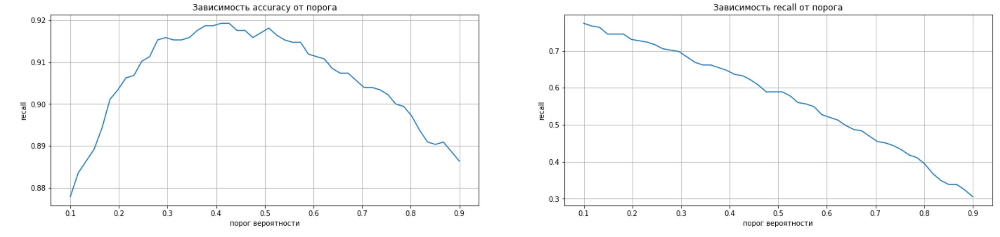

# churn-prediction-telecom
Binary classification telecom customer churn

This project focuses on predicting customer churn for a telecom company.  
The goal is to identify which users are most likely to leave, so the company can take proactive retention measures.  
The operator's team provided data on concluded contracts, personal data and information on services provided: four small databases with sizes of up to 10 thousand records and with a number of features up to 8.

## 🎯 Objectives
- Predict the probability of customer churn using machine learning models
- Identify key factors that influence churn
- Provide actionable business recommendations

## 📂 Data Description
The datasets include:
- Personal data (age, gender, dependents)
- Contract information (contract dates, payment method, charges)
- Internet and phone services usage details (online security, phone service, TV, etc.)

## 🔧 Tools and Technologies
- Python: pandas, numpy, matplotlib, scipy, seaborn, sklearn
- Jupyter Notebook
- Machine Learning: GradientBoosting models, CrossValidation, Pipeline, OrdinalEncoder
- Metrics: ROC AUC, Accuracy, Recall, Confusion Matrix, Phik
- Feature importance analysis

## 🧪 Project Workflow
1. Preprocessing and feature engineering
2. Exploratory data analysis (EDA)
3. Encoding  
4. Model training and evaluation
5. Comparison of models and search for the optimal threshold
6. Interpretation of results and business recommendations

## 📈 Key Results
- Final model AUC: **0.905**
- Maximum accuracy is at threshold value 0.4. Recommended threshold is up to 0.4. Recall at 0.4 is 0.65
- Important features: duration, charges
- Identified risk groups
- Suggested retention strategies for high-risk customer segments

## 📝 Business Recommendations
- A bonus program for risk groups
- Restrain the growth of tariffs
- Check the operation of the electronic check service
- The recommended payment period is less than a year
- Develop offers for married couples

## 📊 Visualizations

